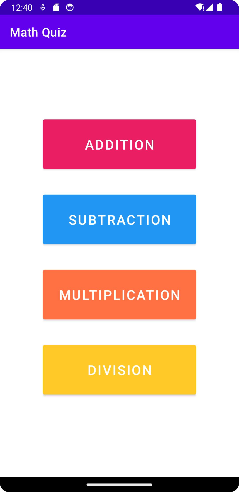
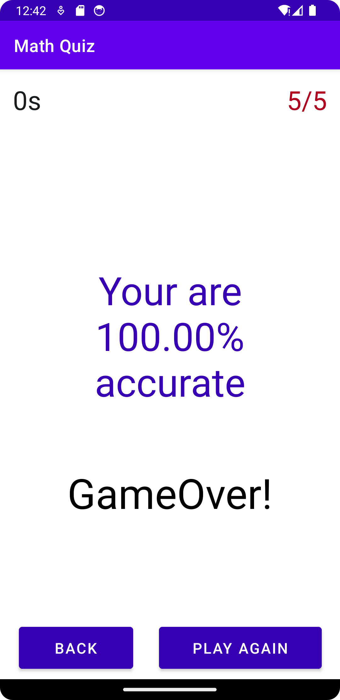

========================================
           MathQuizApp 📱🧮
========================================

Welcome to MathQuizApp! This Android application is designed to make learning math interactive, fun, and educational. Whether you're practicing addition, subtraction, multiplication, or division, this app is perfect for math enthusiasts of all levels.

========================================
          Features 🌟
========================================

1. 🧠 Interactive Quizzes:
   Test your skills in various math topics like addition, subtraction, multiplication, and division.

2. 🎯 Difficulty Levels:
   Choose your challenge with beginner, intermediate, or advanced levels.

3. 📊 Performance Tracking:
   Track your progress and improve over time.

4. 🎨 User-Friendly Design:
   Clean and intuitive interface for a seamless experience.

========================================
          Project Structure 📂
========================================

- .gradle/                -> Gradle-specific files
- .idea/                  -> IDE configuration files
- app/                    -> Application module
- src/                    -> Main source files
  - androidTest/          -> Instrumented tests
  - main/                 -> Application source
    - java/com/example/mathquiz
      - AdditionActivity.java
      - SubtractionActivity.java
      - MultiplicationActivity.java
      - DivisionActivity.java
      - MainActivity.java
      - SecondActivity.java
    - res/                -> Resource files (layouts, drawables, etc.)
    - AndroidManifest.xml -> Application manifest
- gradle/                 -> Gradle wrapper files
- gradlew                 -> Gradle wrapper script (Unix)
- gradlew.bat             -> Gradle wrapper script (Windows)
- build.gradle            -> Build scripts
- settings.gradle         -> Gradle settings
- local.properties        -> Local configuration (e.g., SDK paths)

========================================
          Screenshots 🖼️
========================================

Below are screenshots of the app showcasing its features:

1. **Home Screen**  
     

2. **Quiz Interface**  
     

3. **Results Screen**  
     

========================================
          Getting Started 🚀
========================================

Prerequisites:
1. Android Studio
2. Java JDK 8 or higher
3. Gradle

Steps:
1. Clone the repository:
   git clone https://github.com/EchoSingh/MathQuizApp.git

2. Open the project in Android Studio.

3. Sync Gradle by clicking "Sync Now" in the toolbar.

4. Build and run the app on an emulator or physical device.

========================================
          Contributing 🤝
========================================

We welcome contributions to improve MathQuizApp! Follow these steps:
1. Fork the repository.
2. Create a new branch for your feature or bug fix.
3. Make your changes and commit them.
4. Push your changes to your forked repository.
5. Submit a pull request for review.

========================================
          License 📜
========================================

This project is licensed under the MIT License. See the LICENSE file for details.

========================================
          Contact 💬
========================================

For feedback or questions, feel free to open an issue on GitHub .

Happy learning and coding! 🚀
